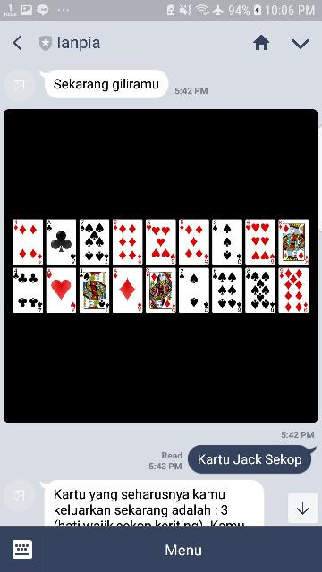
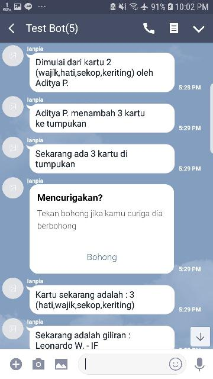
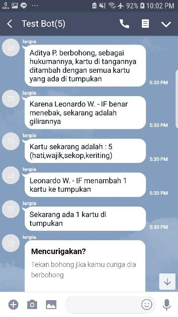
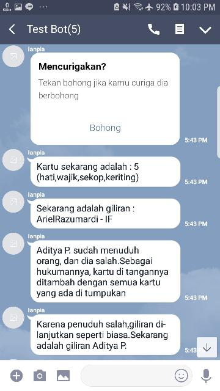

# Ianpia

**Nama    : Aditya Putra Santosa** 
**NIM     : 16517407 / 13517013** 
**Jurusan : Teknik Informatika** 

**Ianpia** (baca : *yan-pya* ) adalah bot Line dengan fitur bermain game **Kartu Bohong**
dengan tujuan menyelesaikan tugas karya SPARTA 2017 HMIF ITB.

Terima kasih saya ucapkan kepada teman-teman saya: 
- Leonardo W. (16517182) 
- Ariel Razumardi (16517089) 
- Irfan Haris (16517117) 

Karya ini tidak mungkin selesai tanpa bantuan teman-teman saya yang telah membantu pada tahap Testing & Debugging 

### Kartu Bohong

**Kartu Bohong** adalah suatu permainan kartu yang biasa dimainkan secara berbanyak (2-7 orang). 
Game ini memiliki tujuan yang sederhana yaitu menghabiskan semua kartu di tangan.

- Setiap pemain bergiliran mengeluarkan kartu dengan urutan 2, 3, 4, 5, 6, 7, 8, 9, 10, Jack, Queen, King, As, lalu kembali ke 2

- Setiap pemain bisa memutuskan untuk mengeluarkan 1 hingga 4 kartu sekaligus ke tumpukan tanpa diketahui oleh pemain lain apa yang dikeluarkan

- Setiap pemain juga bisa memutuskan untuk berbohong, misalnya sekarang harusnya yang keluar ke tumpukan adalah kartu Jack.
tapi pemain yang dapat giliran saat itu memutuskan untuk mengeluarkan 3 Hati dan 7 Wajik ke tumpukan
- Jika ada pemain lain yang curiga, pemain lain tersebut bisa berkata '**Bohong**' agar bisa mengecek 2 kartu yang baru saja ditambahkan ke tumpukan.
Karena 2 kartu tersebut bukan Jack maka pemain yang berbohong tersebut harus mengambil semua kartu di tumpukan, lalu permainan dilanjutkan oleh pemain yang menyebut '**Bohong**' tersebut

- Jika ada pemain yang curiga, lalu ia berkata '**Bohong**' namun ternyata kartu yang baru saja ditambahkan ke tumpukan sesuai urutannya maka ia harus mengambil semua kartu di tumpukan dan game berjalan seperti biasa

- Seorang pemain dikatakan **menang** jika kartu di tangannya habis

- Game berakhir saat tersisa 1 pemain, pemain yang tersisa tersebut secara automatis **kalah**

### Cara menggunakkan Bot Ianpia

**Ianpia** bisa digunakan dengan menambahkan **@emn0538m** di **Line** lalu menginvitenya ke group 

Untuk memulai permainan ketik **.kartuBohong**, bot akan memberikan tombol join untuk bergabung  
    **Note :  
            - ingat untuk tambahkan bot sebagai teman sebelum bergabung 
             - jumlah pemain maksimal adalah 7 orang dan minimal 2 orang**  
- Ketika semua pemain telah gabung, ketik **.mulai** untuk memulai permainan  
 Setelah dimulai, bot akan memberi tahu urutan permainan di grup dan kartu dari setiap pemain melalui 1:1 chat 
 

- Di 1:1 chat dengan bot, pemain akan mendapatkan gambar setiap kartu yang dimilikinya dalam bentuk Imagemap yang bisa diklik.  
 Klik kartu yang ingin ditambah ke tumpukkan (minimal 1, maksimal 4 kartu)
 

- Setelah itu bot akan memberi pilihan untuk submit ke tumpukan atau ulang pilih kartu
 

 Selain mengklik submit pemain juga bisa mengetik '**Gaskeun Bosq**' untuk submit

- Jika pemain memilih untuk mengulang maka pemain bisa mengklik tombol **Ulang** atau bisa juga mengetik **Aku mau ulang**. 
 Setelah itu pemain bisa mengeklik kembali kartu yang diinginkan 
 

- Jika sudah memilih dan mensubmit kartu ke tumpukan, di grup akan muncul pesan seperti berikut 
 

- Di grup juga muncul tombol **Bohong** untuk menuduh pemain yang terakhir menambahkan ke tumpukan 
 Jika di klik akan ada 2 kemungkinan yang muncul yaitu 
  - Pemain terakhir **berbohong** 
  

  - Pemain terakhir **jujur** 
  

- Ketika salah satu pemain telah menghabiskan kartunya maka ia **menang** dan dikeluarkan dari permainan 
 Jika sisa pemain hanyalah 1, maka pemain terakhir tersebut automatis **kalah** 
 

- Selain itu, game juga bisa diberhentikan di tengah tengah dengan perintah **.berhenti**
 

### Kontak
Jika ada masalah, bisa ditulis di bagian **Issue** di repo ini, atau bisa juga dengan mengontak saya di: 
    - **Line  : adityaputrasantosa**  
    - **Email : adityaputra159@gmail.com** 
